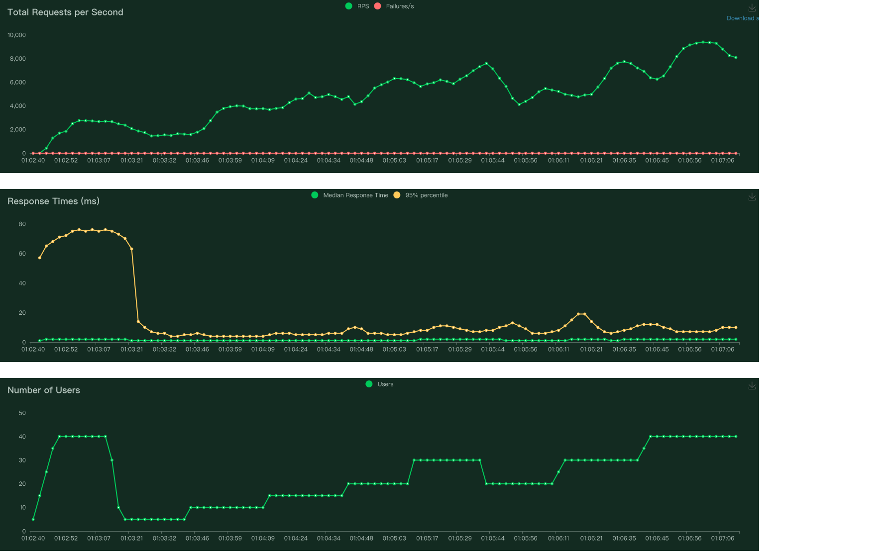
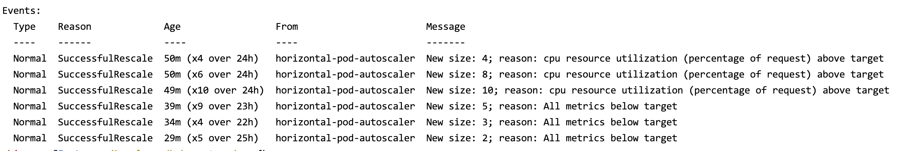

# Kubernetes-HPA-demo

Kubernetes experimentation to demonstrate the scale up and scale down capabilities

[Kubernetes](https://kubernetes.io/)  
[Horizontal Pod Autoscaling](https://kubernetes.io/docs/tasks/run-application/horizontal-pod-autoscale/)

## Tools

[minikube](https://minikube.sigs.k8s.io/docs/start/)  
[Locust](https://locust.io/)

## Experimentation

1. [Install](https://minikube.sigs.k8s.io/docs/start/)

```bash
brew install minikube
```

2. [Start the cluster with Docker as driver](https://minikube.sigs.k8s.io/docs/drivers/docker/)

```bash
minikube start --driver=docker
```

3. Enable the metrics-server and dashboard

```bash
minikube addons enable metrics-server
minikube addons enable dashboard
minikube dashboard
```

Now you can see the dashboard to watch the performance of the pods.

4. Build the docker image

```bash
eval $(minikube docker-env)
docker build -t hello-node:v1 .
```

5. Create the deployment and expose the service

```bash
kubectl create deployment hello-node --image=hello-node:v1 --port=8080
kubectl set resources deployment hello-node --requests cpu=10m,memory=20Mi --limits cpu=80m,memory=100Mi
kubectl expose deployment hello-node --type=NodePort --port=8080
```

For the experiment purpose, we will give the deployment a very limited resource so that it will be scaled up and down.

6. Create the HPA

```bash
kubectl autoscale deployment hello-node --min=2 --max=10 --cpu-percent=20
```

7. Start the service

```bash
minikube service hello-node
```

Now you can request the service with the URL provided by the command above.

8. Locust experimentation

```bash
locust -f load.py
```

## Results
Locust:  
  

HPA events:  

## References

1. https://www.containiq.com/post/using-minikube-for-basic-kubernetes
2. https://www.containiq.com/post/kubernetes-autoscaling
3. https://ningg.top/kubernetes-series-02-deploy-an-application/
4. https://github.ncsu.edu/rrangar/locust
5. https://docs.locust.io/en/stable/running-distributed.html
6. https://kubernetes.io/docs/tasks/run-application/horizontal-pod-autoscale/
7. https://kubernetes.io/docs/tasks/run-application/horizontal-pod-autoscale-walkthrough/
8. https://stackoverflow.com/questions/67604295/error-from-server-notfound-deployments-apps-wordpress-not-found-i-am-gett
9. https://stackoverflow.com/questions/69059568/k8s-error-from-server-notfound-deployments-apps-nginx-not-found